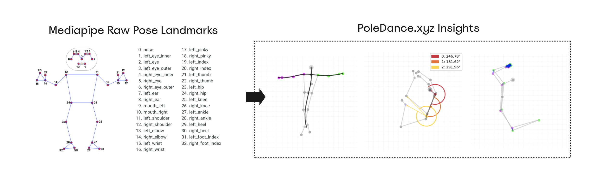

# poledance.xyz 💃 🕺

poledance.xyz is a pole diary app.. that lets you visualize pose data into insights!



## Features

(coming soon)

## Structure

```
├── LICENSE
├── README.md
├── app/
│   ├── accounts/
│   ├── models/
│   ├── services/
│   ├── static/
│   ├── static/
│       ├── data/dictionary.csv
│   └── templates/
├── data
├── config.py
└── tests
```

## Resources

1. [Flask 3.0.x](https://flask.palletsprojects.com/en/3.0.x/)
2. [Bootstrap v5.3.2](https://getbootstrap.com/)