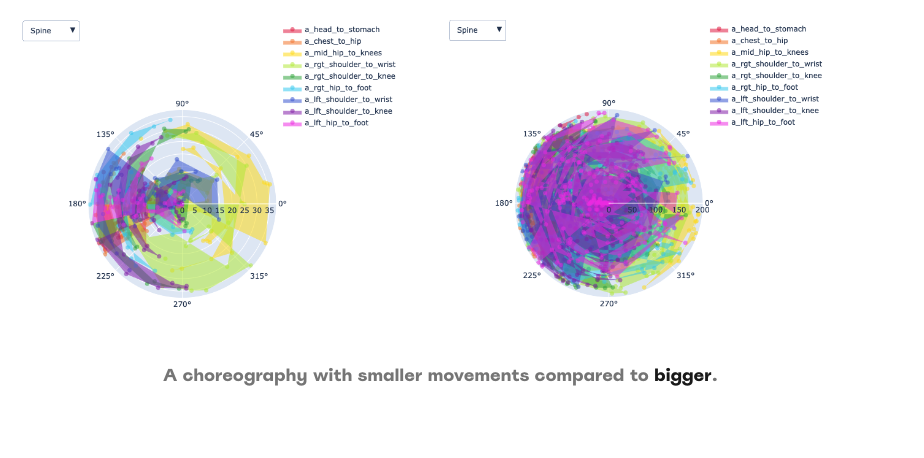

# poledance.xyz | transforming your movement 💃 (x,y,z)'s like a-b-c!

Poledance.xyz is an online platform designed for managing solo choreography in the field of pole fitness. It employs a data science framework to distill complex movements into simplified terms and generate reports that systematically codify a dance. The beta version features:

1. An online dictionary and visualization tools for domain-specific dance movements.
2. An online diary for users to upload videos and receive personalized reports with statistics.
3. Documented data processing and algorithm development steps.

Key achievements:
1. Collecting and labeling images and videos for a diverse dataset.
2. Integrating kinematic data to analyze poses using Mediapipe Pose Landmarker Task
3. Creating plot and figure aesthetics to convey pattern and insights
4. Simple error analysis from a single user to refine future development

## Features

### Pose Dictionary 


### Personalized and Aggregated Reports


### Plot and Figure Aesthetics



## Structure

The beta application uses a monolithic architecture with Flask, featuring modular design patterns for scalability and organized into distinct functional modules.

```
.
├── app
│   ├── accounts/
│   ├── api/
│   ├── diary/
│   ├── dictionary/
│   ├── extensions/
│   ├── models/
│   ├── reports/
│   ├── services/
│   ├── static/
│   ├── templates/
│   ├── utilities/
│   └── wsgi.py
├── config.py
├── docs/
├── requirements.txt
├── tests/
│   ├── integrated/
│   └── unit/
└── wgsi.py
```

# Resources

### Python Libraries

- Matplotlib (https://matplotlib.org/)
- MediaPipe (https://github.com/google/mediapipe)
- Numpy(https://numpy.org/)
- OpenCV (https://github.com/opencv/opencv)
- Pandas (https://pandas.pydata.org/docs/index.html
- Plotly (https://plotly.com/python/)
- Scikit-learn (https://scikit-learn.org/stable/)
- Scipy (https://scipy.org/)

### Web Development

1. Flask 3.0.x(https://flask.palletsprojects.com/en/3.0.x/)
2. Bootstrap v5.3.2 (https://getbootstrap.com/)

### Domain Knowledge

1. Kartaly, I. (2018). Pole Dance Fitness.Cardinal Publishers Group
2. Nicholas, J., Weir, G., Alderson, J. A., Stubbe, J. H., van Rijn, R. M., Dimmock, J. A., Jackson, B., & Donnelly, C. J. (2022). Incidence, Mechanisms, and Characteristics of Injuries in Pole Dancers: A Prospective Cohort Study. Medical problems of performing artists, 37(3), 151–164. https://pubmed.ncbi.nlm.nih.gov/36053493/
