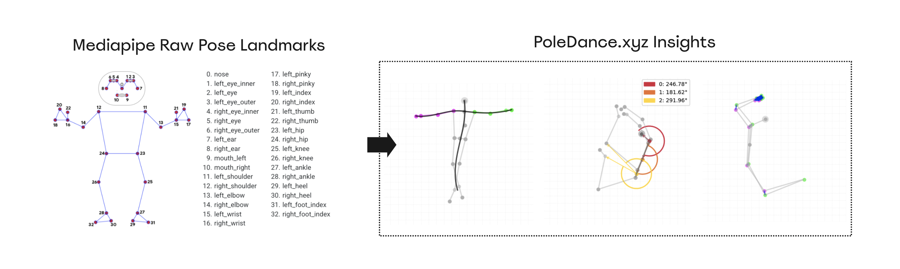
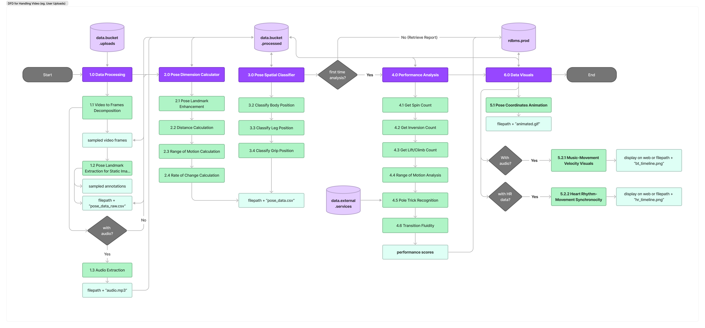
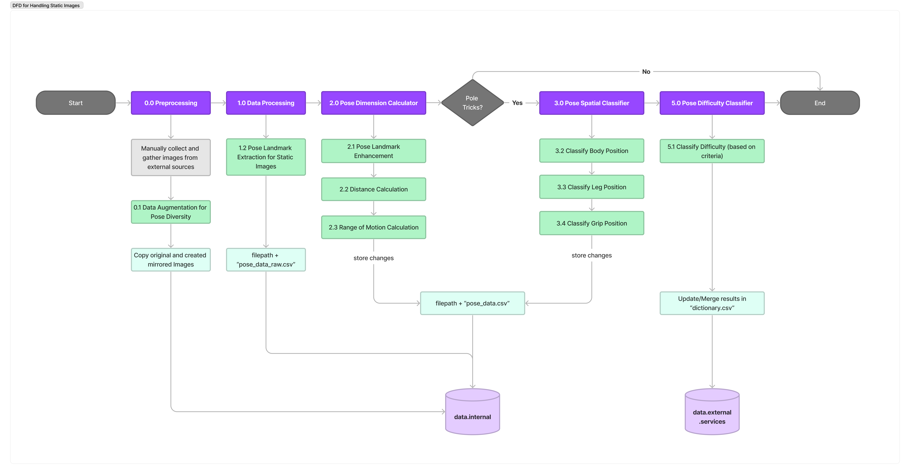

# poledance.xyz 💃 🕺

This section is the documentation for class implementations of key services in poledance.xyz 

## Video Data Processing

The data flow diagram below illustrates our method for handling and analyzing video data. The process is designed to accommodate the temporal aspects of video imagery, allowing for a detailed examination over time.

(See `images/dfd_video.pdf` for higher resolution)

## Static Image Data Processing

This diagram outlines the data flow specific to the management of static images, serving as a reference for pose data within images.

(See `images/dfd_static.pdf` for higher resolution)

## Python Libraries

- Matplotlib (https://matplotlib.org/)
- MediaPipe (https://github.com/google/mediapipe)
- Numpy(https://numpy.org/)
- OpenCV (https://github.com/opencv/opencv)
- Pandas (https://pandas.pydata.org/docs/index.html

### Additional Resources

1. Kartaly, I. (2018). Pole Dance Fitness.Cardinal Publishers Group
2. Nicholas, J., Weir, G., Alderson, J. A., Stubbe, J. H., van Rijn, R. M., Dimmock, J. A., Jackson, B., & Donnelly, C. J. (2022). Incidence, Mechanisms, and Characteristics of Injuries in Pole Dancers: A Prospective Cohort Study. Medical problems of performing artists, 37(3), 151–164. https://pubmed.ncbi.nlm.nih.gov/36053493/